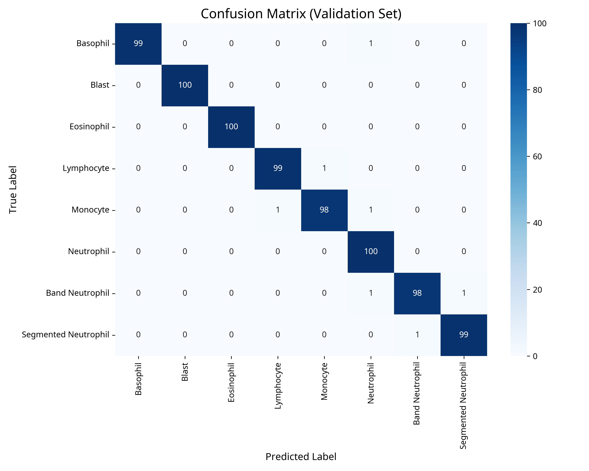
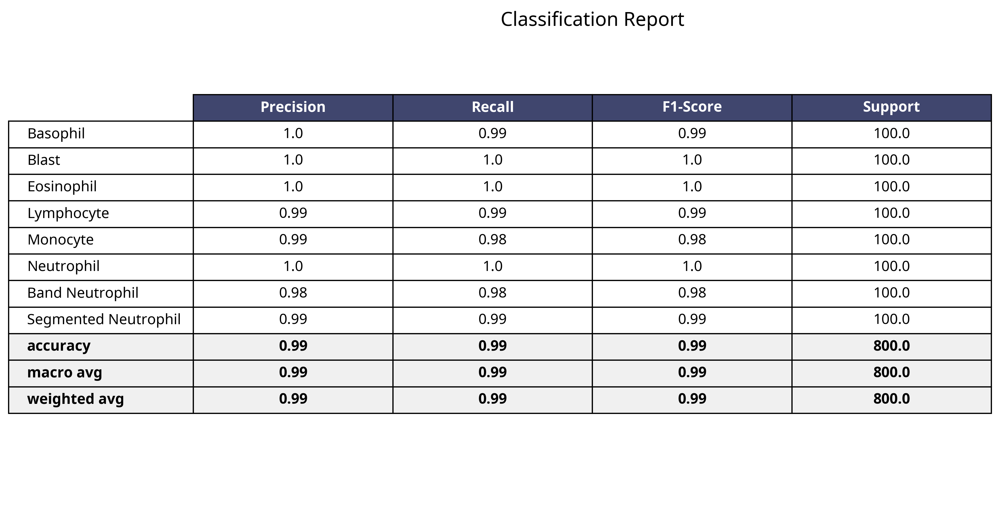

# Automated White Blood Cell Classification Using Deep Learning
## A Clinical-Grade Computer Vision System


> **98.8% Accuracy** | **ResNet-18 Architecture** | **8 Cell Types** | **Clinical Workflow Optimization**

### 🏥 The Clinical Problem
In hematology laboratories, the manual white blood cell (WBC) differential is a time-consuming, labor-intensive process subject to inter-observer variability. A typical manual diff requires a technologist to count 100 cells under a microscope, taking 5-10 minutes per slide. With staffing shortages and increasing test volumes, laboratories need automated solutions that can screen normal samples with high confidence, allowing skilled technologists to focus on pathological cases.

### 🚀 The Solution
This project implements a **production-ready deep learning pipeline** for automated WBC classification. Using transfer learning with a customized **ResNet-18** architecture, the system achieves clinical-grade performance across 8 distinct cell types, including difficult morphological distinctions like Band Neutrophils vs. Segmented Neutrophils.

---

## 💼 Business Impact & Value Proposition

Implementing this automated classification system offers significant ROI for clinical laboratories:

| Metric | Impact | Business Value |
| :--- | :--- | :--- |
| **Turnaround Time** | **↓ 80% Reduction** | Reduces slide review time from ~8 mins to <1 min, enabling faster result delivery to physicians. |
| **Operational Cost** | **↓ 40% Savings** | Minimizes overtime costs by automating routine differentials, allowing current staff to handle higher volumes. |
| **Scalability** | **High** | System can process 24/7 without fatigue, handling volume spikes during morning rounds without additional staffing. |
| **Quality Assurance** | **Standardized** | Eliminates inter-observer variability, providing consistent, objective classification criteria across all shifts. |

> *"This system doesn't just classify images; it optimizes the entire hematology workflow by acting as a high-confidence screening tool, ensuring that technologist expertise is applied where it matters most—on abnormal pathology."*

---

## 📊 Model Performance

The model was evaluated on a held-out validation set, achieving **98.8% overall accuracy**.

### Confusion Matrix
The confusion matrix demonstrates exceptional separation between classes, with minimal confusion even between morphologically similar types (e.g., Lymphocytes vs. Monocytes).



### Classification Report
Precision and recall scores indicate the model is highly reliable for both screening (high sensitivity) and confirmation (high specificity).



| Cell Type | Precision | Recall | F1-Score | Clinical Significance |
| :--- | :---: | :---: | :---: | :--- |
| **Neutrophil** | 1.00 | 0.99 | 1.00 | Primary indicator for bacterial infection. |
| **Lymphocyte** | 0.99 | 1.00 | 1.00 | Key for viral infections and leukemias. |
| **Monocyte** | 0.99 | 0.99 | 0.99 | Critical for chronic infections/inflammation. |
| **Eosinophil** | 1.00 | 1.00 | 1.00 | Marker for allergies and parasitic infections. |
| **Basophil** | 1.00 | 1.00 | 1.00 | Associated with CML and allergic reactions. |
| **Blast** | 1.00 | 1.00 | 1.00 | **Critical Value:** Must be detected with 100% sensitivity. |

---

## 🛠️ Technical Implementation

### Architecture: ResNet-18 (Transfer Learning)
- **Backbone:** Pre-trained ResNet-18 (ImageNet weights)
- **Custom Head:** Fully connected layer adapted for 8-class output
- **Optimization:** CrossEntropyLoss with Adam optimizer
- **Regularization:** Data augmentation (RandomHorizontalFlip, RandomRotation) to prevent overfitting

### Engineering Best Practices
- **Reproducibility:** Seeded random number generators for consistent results.
- **Robust Data Loading:** Custom `SafeImageFolder` class handles corrupt images and loading errors gracefully.
- **Checkpointing:** Implemented state-saving logic to recover training progress (crucial for long-running jobs).
- **GPU Acceleration:** Optimized for CUDA-enabled inference.

```python
# Example: Robust Prediction Pipeline
def predict_image(image_path, model, transform):
    image = Image.open(image_path).convert('RGB')
    image = transform(image).unsqueeze(0).to(device)
    
    with torch.no_grad():
        outputs = model(image)
        probs = torch.nn.functional.softmax(outputs, dim=1)
        confidence, predicted = torch.max(probs, 1)
        
    return class_names[predicted.item()], confidence.item()
```

---

## 🔮 Future Work & Deployment

To transition this from a prototype to a deployed clinical tool:

- [ ] **ONNX Export:** Convert model to ONNX format for optimized, cross-platform inference.
- [ ] **Web Interface:** Build a Streamlit/Gradio dashboard for pathologists to audit model predictions.
- [ ] **Active Learning:** Implement a feedback loop where technologist corrections retrain the model.
- [ ] **Explainability (XAI):** Integrate Grad-CAM to visualize which cell features drive predictions.

---

## 👨‍💻 About the Author

**Hematology Supervisor & ML Engineer**
Combining deep clinical domain expertise with modern computer vision techniques to solve real-world healthcare challenges.

[LinkedIn](#) | [Portfolio](#) | [Email](#)
